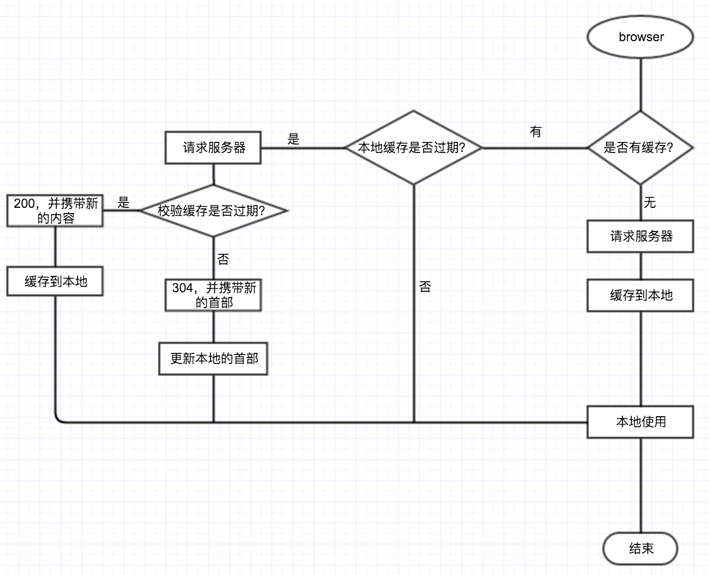

# 性能

## DNS 预解析
```html
<link rel="dns-prefetch" href="//yuchengkai.cn" />
```

## 缓存
### 强缓存
#### Expires 和 Cache-Control
- Cache-Control
  - max-age：存的时间
  - public：表示可以被浏览器和代理服务器缓存，刷新操作，就向服务器发起http请求
  - immutable：让用户在刷新页面的时候不要去请求服务器
  - private：表示只可以被浏览器缓存
  - no-cache：跳过强缓存
  - no-store：没有缓存

```js
	Expires: Wed, 22 Oct 2018 08:41:00 GMT
	Cache-control: max-age=30
	// 常见的设置是max-age public private no-cache no-store等
```

### 协商缓存
#### 协商缓存需要请求，如果缓存有效会返回 304。
```js
etag: '5c20abbd-e2e8'
last-modified: Mon, 24 Dec 2018 09:49:49 GMT
```
- ETag：文件hash
- last-modified：文件的修改时间，精确到秒
- 发请求-->看资源是否过期-->过期-->请求服务器-->服务器对比资源是否真的过期-->
- 没过期-->返回304状态码-->客户端用缓存的老资源。
- 过期-->返回200状态码-->客户端如第一次接收该资源一样，记下它的cache-control中的max-age、etag、last-modified等。

#### 为什么要有etag？
- 某些文件修改非常频繁，(比方说1s内修改了N次)，if-modified-since能检查到的粒度是秒级的，这种修改无法判断(或者说UNIX记录MTIME只能精确到秒)；
- 某些服务器不能精确的得到文件的最后修改时间。

### 怎么设置强缓存与协商缓存
```js
// 后端服务器如nodejs:
res.setHeader('max-age': '3600 public')
res.setHeader(etag: '5c20abbd-e2e8')
res.setHeader('last-modified': Mon, 24 Dec 2018 09:49:49 GMT)
// nginx配置

add_header Cache-Control 'no-cache, no-store'


```

## 缓存流程
