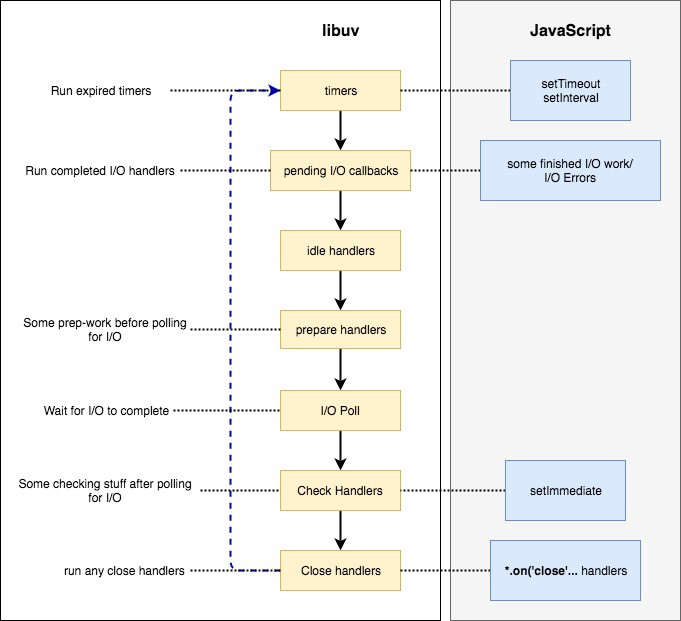

# Event Loop

## 同步任务队列

## 宏队列
- setTimeout
- setInterval
- setImmediate (Node独有)
- I/O Callback
- requestAnimationFrame (浏览器独有)
- UI rendering (浏览器独有)

## 微队列
- process.nextTick (Node独有)
- Promise

## 浏览器
### 在浏览器中，可以认为只有一个宏队列和一个微队列，所有的macrotask都会被加到这一个宏队列中，所有的microtask都会被加到这一个微队列中。
1. 宏队列macrotask一次只从队列中取一个任务执行，执行完后就去执行微任务队列中的任务；
2. 微任务队列中所有的任务都会被依次取出来执行，直到microtask queue为空；
3. 在执行微队列microtask queue中任务的时候，如果又产生了microtask，那么会继续添加到队列的末尾。
4. 单次事件循环中，macroTask的任务仅处理优先级最高的那一个，而microTask要执行完所有。
5. 主线程的执行过程就是一个宏队列任务

```ts
console.log(1);

setTimeout(() => {
  console.log(2);
  Promise.resolve().then(() => {
    console.log(3)
  });
});

new Promise((resolve, reject) => {
  console.log(4)
  resolve(5)
}).then((data) => {
  console.log(data);
})

setTimeout(() => {
  console.log(6);
})

console.log(7);
// 1 4 7 5 2 3 6
```


## NodeJS

### NodeJS中宏队列主要有4个
### 这5个都属于宏队列，在NodeJS中，不同的macrotask会被放置在不同的宏队列中。
- Timers Queue（Ex：setTimeout）
- pending Callbacks Queue（Ex：TCP）
- Poll Queue（Ex：I/O Callback）
- Check Queue（Ex：setImmediate）
- Close Callbacks Queue（Ex：scoket close）

### NodeJS中微队列主要有2个：
### 在NodeJS中，不同的任务会被放置在不同的任务队列中。
- Next Tick Queue：是放置process.nextTick(callback)的回调任务的
- Other Micro Queue：放置其他microtask，比如Promise等
- NodeJS可以理解成有5个宏任务队列和2个微任务队列，但是执行宏任务时有6个阶段。
- 先执行全局Script代码，执行完同步代码调用栈清空后，
- 宏任务按顺序执行
- 每个宏任务执行完成之后就去执行微任务，和浏览器相同；
- 微任务队列先执行Next Tick Queue， 再Other Microtask Queue。
  
> Node 10 的时候是完整执行一个宏队列之后才去执行微任务，但是在之后的node版本中，开始和浏览器同逻辑，每个宏任务执行完成之后就去执行微任务
> 谨慎setTimeout(f, 0)等同于setTimeout(f, 1)。

### libuv


### 描述

```ts
const fs = require('fs');

const timeoutScheduled = Date.now();

// 异步任务一：100ms 后执行的定时器
setTimeout(() => {
  const delay = Date.now() - timeoutScheduled;
  console.log(`${delay}ms`);
}, 100);

// 异步任务二：文件读取后，有一个 200ms 的回调函数
// 文件读取90ms
fs.readFile('test.js', () => {
  const startCallback = Date.now();
  while (Date.now() - startCallback < 200) {
    // 什么也不做
  }
});


// 题目2

fs.readFile('test.js', () => {
  setTimeout(() => {
    console.log('fs readFile settimeout');
  }, 0);
  setImmediate(() => {
    console.log('fs readFile setImmediate');
  });
});
setTimeout(() => {
    console.log('settimeout');
}, 0);
setImmediate(() => {
  console.log('setImmediate');
});
process.nextTick(() => {
  console.log('nextTick');
})

// nextTick
// settimeout
// setImmediate
// fs readFile setImmediate
// fs readFile settimeout

```
#### 分析
1. 第一轮事件循环后，没有到期定时器（Timers Queue），也没有I/O回调（IO Callbacks Queue）所以在poll阶段等待readFile完成，完成之后进入第二轮
2. 没有到期定时器，有I/O回调，执行，最后卡在while中，完成之后在去执行settimeout

### Test
```ts
console.log('1');

setTimeout(function() {
    console.log('2');
    process.nextTick(function() {
        console.log('3');
    })
    new Promise(function(resolve) {
        console.log('4');
        resolve();
    }).then(function() {
        console.log('5')
    })
})

new Promise(function(resolve) {
    console.log('7');
    resolve();
}).then(function() {
    console.log('8')
})
process.nextTick(function() {
  console.log('6');
})

setTimeout(function() {
    console.log('9');
    process.nextTick(function() {
        console.log('10');
    })
    new Promise(function(resolve) {
        console.log('11');
        resolve();
    }).then(function() {
        console.log('12')
    })
})
// Node 10  	1 7 6 8 2 4 9 11 3 10 5 12
// Node 10 之后 1 7 6 8 2 4 3 5 9 11 10 12
```


