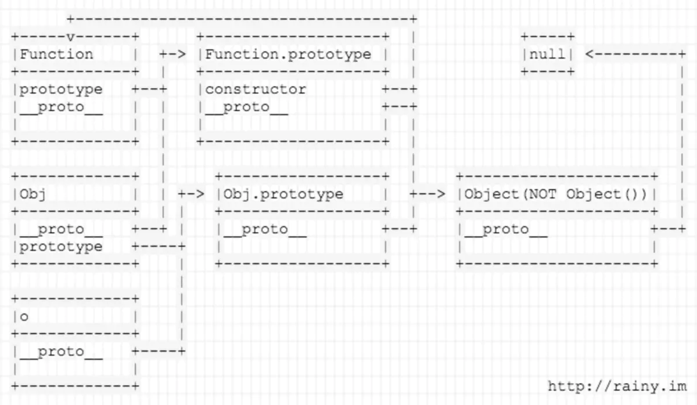
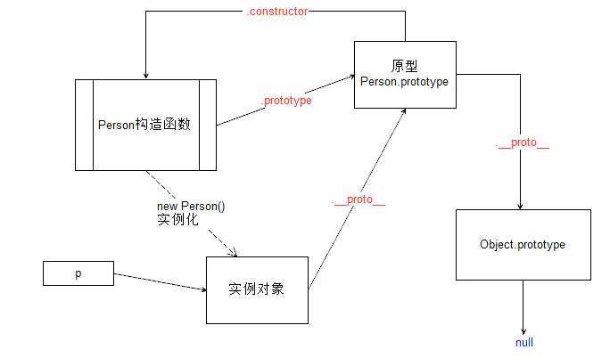

# 原型和原型链
### 函数才有的属性

## __proto__
- 每个对象都有的属性
- 大多情况下可以理解为构造器的原型（`__proto__ === constructor.prototype`）
- `Object.prototype.__proto__` === null


1. 所有的构造器的constructor都指向Function

2. Function的prototype指向一个特殊匿名函数，而这个特殊匿名函数的proto指向Object.prototype



## 构造函数 对象原型链结构图
### EX： function Person (){}; var p = new Person();


## 属性搜索原则
1. 所谓的属性搜索原则, 就是对象在访问属性与方法的时候, 首先在当前对象中查找
2. 如果当前对象中存储在属性或方法, 停止查找, 直接使用该属性与方法
3. 如果对象没有改成员, 那么再其原型对象中查找
4. 如果原型对象含有该成员, 那么停止查找, 直接使用
5. 如果原型还没有, 就到原型的原型中查找
6. 如此往复, 直到直到 Object.prototype 还没有, 那么就返回 undefind.
7. 如果是调用方法就包错, 该 xxxx 不是一个函数

```ts
// EX
function Foo() {};

let f1 = new Foo();
let f2 = new Foo();
let o1 = new Object();
let o2 = new Object();

f1.__proto__ === Foo.prototype === f2.__proto__;
f1.__proto__.__proto__ === Object.prototype ;
f1.__proto__.__proto__.__proto__ === null ;
f1.constructor === Foo.prototype.constructor === Foo;
Foo.prototype.__proto__ === Object.prototype; 
Object.prototype.__proto__ === null; 
Object.prototype.constructor === Object; 
Object.__proto__ === Function.prototype; 
Function.prototype.__proto__ === Object.prototype; 
Function.__proto__ === Function.prototype = f() {}; 
Foo.__proto__ === Function.prototype;
o1.__proto__ === Object.prototype;
```


### 一个小问题
#### eslint 推荐使用下面的那种写法
```ts

let a = new Object();
a.a = 1;

a.hasOwnProperty('a')
Object.hasOwnProperty.call(a, 'a')

```
#### 因为没法保证a的来源，举例a是{},他就没有hasOwnProperty
