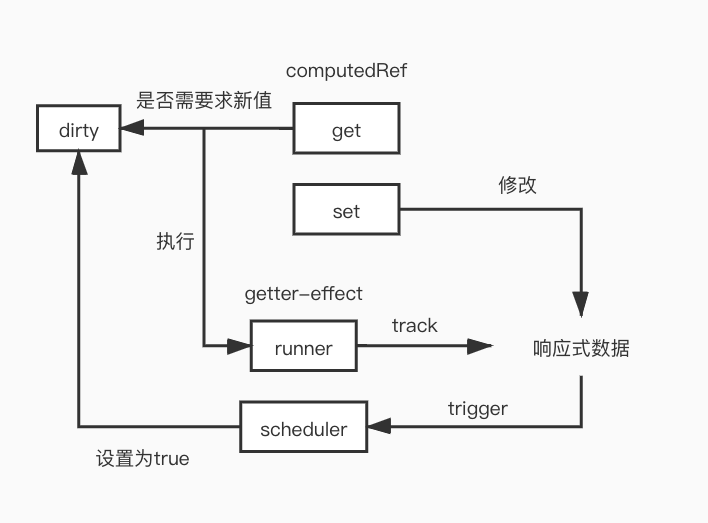

# [Computed](https://v3.cn.vuejs.org/api/computed-watch-api.html#computed)

## 处理逻辑
### 创建 getter 副作用函数
#### 在computed内部使用了effect包裹getter函数，注意此时effect的第二个参数， 将lazy设置成true并且传入了调度函数；同时传入调度函数但是这里没有使用到调度函数的入参effect


### 创建 computed ref
#### computedRef的创建还是蛮简单的，我们需要关注的是get的实现，我们注意到get返回的是computed函数作用域下的value， 也就意味着computedRef.value是通过维护这个值来提供的（缓存）；在get函数内部我们看到了当dirty为true时会执行runner来求值， 我们思考一下在访问computedRef.value时如果需要求新值我们就计算runner来求值并更新value，如果不需要则直接返回value。

### 那么我们怎么知道何时需要求新值呢？
#### 注意这段逻辑
```tsx
    this.effect = effect(getter, {
      lazy: true,
		//+ getter内部收集的track发生变化时触发scheduler，scheduler触发computed的trigger，
		//+ 这就意味着此时收集了computedRef的副作用的函数会重新执行（使用了computed.value的）
		//+ 而在这个副作用函数中一定会对computedRef产生get访问，
		//+ 此时又回到get函数内部发现drity为需要求值，就执行runner进行真实的求值。
      scheduler: () => {
        if (!this._dirty) {
          this._dirty = true
          trigger(toRaw(this), TriggerOpTypes.SET, 'value')
        }
      }
    })
      lazy: true,
      scheduler: () => {
        if (!this._dirty) {
          this._dirty = true
          trigger(toRaw(this), TriggerOpTypes.SET, 'value')
        }
      }
    })
```

-----

## 简单流程

