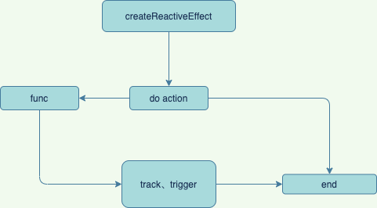
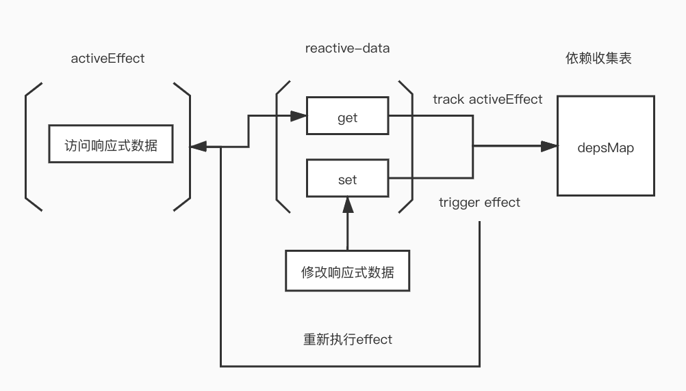

# Effect

## 定义
```ts
export interface ReactiveEffectOptions {
  // 是否为lazy模式
  lazy?: boolean;
  // 执行副作用函数的调度器
  scheduler?: (job: ReactiveEffect) => void;
  // debugger函数
  onTrack?: (event: DebuggerEvent) => void;
  onTrigger?: (event: DebuggerEvent) => void;
  // 副作用停止的钩子函数
  onStop?: () => void;
}
```

## pauseTracking 暂停收集
## enableTracking 开启收集
## resetTracking 重置当前 shouldTrack 状态

## targetMap
### 存放收集的依赖
### 结构简单视图
```ts
  {
    [target]: Map{
      [key]: Set[effect]
    }
  }

  effect{
    deps： Map[effect] []
  }
```

## createReactiveEffect
### lazy选项和computed强相关
### 处理逻辑
- 处理激活状态，effect.active来表示副作用函数的激活状态，在stop一个副作用函数后会将其置成false；在没有激活的情况下如果有自定义调度函数则不执行不然的话返回函数的执行结果。
### 清除操作
- effect.deps是一个数组，存储的是该effect依赖的每个属性的depsSet副作用函数表(目标所有的effect集合)
- track阶段建立的依赖存储表中，每个响应式对象触发依赖收集的key都会对应一个副作用的Set表下文以depsSet来称呼
- 在正式开始执行fn前，会先cleanup当前effect的deps（存储的是当前effect中trigger属性，它依赖的所以副作用depsSet表）；
- 这样做的意义就在于, 我们能在effect再次执行之前，从所有收集到此effect函数的depsSet中剔除该effect，以便在此次effect执行时重新收集； 这一步操作的意义在于如下场景：

```HTML
<template>
  <div v-if="showFalg">
    {{ num1 }}
  </div>
  <div>
    {{ num2 }}
  </div>
</template>
<script>
export default {
  setup() {
    const showFalg = ref(true);
    const num1 = ref(0);
    const num2 = ref(0);
    return {
      showFalg,
      num1,
      num2,
    };
  },
};
</script>

```
- 解释：
  - 我们知道模板的执行是一个副作用渲染函数，首次渲染会将当前组件的副作用渲染函数收集到showFalg, 
  - num1对应的depsSet中（effect）， 我们改变showFalg为false，触发渲染函数重新执行，
  - 此时如果我们不进行cleanup，num1, num2, showFalg都会收集到副作用渲染函数， 因为第一次执行时收集到了num1
  - 而现在num1是并未显示在页面，我们更改它的时候并不需要触发渲染函数的重新渲染。
  - 只有在重新执行副作用渲染函数之前进行cleanup操作， 才能确保每次渲染函数执行后依赖收集的正确性
## track
### track的目标很简单，建立当前key与当前激活effect的依赖关系，源码中使用了一个较为复杂的方式来保存这种依赖关系， 见targetMap，完整的存储了对象、键值和副作用的关系，并且通过Set来对effect去重。

## trigger
### trigger依赖的还是track阶段生成的targetMap存储的依赖和副作用函数关系，来查找所有应该被执行的副作用函数来遍历执行。
### trigger函数的逻辑还是比较清晰的，主要有如下步骤：

> 依据不同情况取出副作用函数列表
> 过滤当前激活副作用函数，添加其他副作用函数
> 遍历运行所有被添加副作用函数

#### 伪代码
```ts

export function trigger(
  target: object,
  type: TriggerOpTypes,
  key?: unknown,
  newValue?: unknown,
  oldValue?: unknown,
  oldTarget?: Map<unknown, unknown> | Set<unknown>
) {
  // 原则是，存在才添加
  // 0、从targetMap中取这个target的依赖

  // 1、处理 TriggerOpTypes.CLEAR 类型的trigger
  // Map或Set被清空时需要调用整个target对应的所有effect
  // 2、数组长度变更，触发key 为 length的track或者索引在后（新加）的那个key的track

  // 3、不满足1、2直接添加所有有依赖的副作用函数；SET | ADD | DELETE这三种类型
  // 3.1、非数组的ADD，需要在触发原值的ITERATE_KEY track，是map则在加上 MAP_KEY_ITERATE_KEY
  // 3.2、DELETE与ADD同理
  // 3.3、SET的时候考虑到map等情况，增加ITERATE_KEY 的 track

  // 4、执行所有搜集到的effect，effect有scheduler则通过scheduler执行否则直接执行
}

```
-----

## 简单流程


