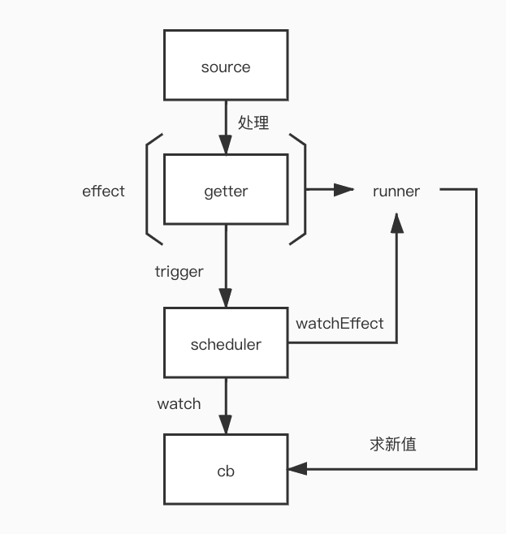

# [watch](https://v3.cn.vuejs.org/api/computed-watch-api.html#watch)

## 处理逻辑
#### watch和watchEffect的实现都内聚在doWatch中，直接看处理逻辑

## doWatch

### 处理source参数
- watch函数的source参数有多个形态，我们的目标是通过source的不同传参来构建getter函数能访问到source都所有响应式数据；主要有ref、reactive、function和array这四种类型

```ts
export type WatchSource<T = any> = Ref<T> | ComputedRef<T> | (() => T);
source: WatchSource<T> | (WatchSource<T> | object)[] | object
```

#### ref
1. 直接创建一个访问到ref.value的getter函数。

#### reactive
1. 默认deep：true
#### function
1. watch的情况下直接执行这个function，注意这里使用了callWithErrorHandling包裹（异常捕获）
2. watchEffect的情况下，首先看组件是否被卸载，每次执行都要清理下上一次source产生的副作用

#### array
1. 遍历访问到每个子项
2. 子项为reactive对象的时候进行一次traverse

#### traverse
1. 针对不同类型来递归访问每个属性

### 生成执行cb的函数
- 调用effect runner求新值（getter的重新执行）
- watchEffect的情况则直接执行runner；watch的情况先通过runner求新值再执行cb；同时为了在每次重新执行runner前清除cb中产生的副作用， 将提供一个cleanup在doWatch内部保存清除副作用函数以供job调用runner前清除副作用； 提供一个onInvalidate作为参数来传递用户编写cb时需要清除的副作用。

### 创建scheduler调度器
- getter通过trigger触发的执行会交到scheduler来处理，可想而知scheduler中一定是需要针对watch或watchEffect做不同处理的。
- scheduler并不是直接进行逻辑处理，flush来决定调度的时机（）
> sync：同步执行
> pre：组件更新之前执行 
> post：组件更新后执行


### 创建副作用函数
- watch或者watchEffect内部需要做的还是创建一个包裹getter的副作用函数来追踪getter访问到的响应式数据变化以自动执行；
- effect的处理和computed的内部处理非常相似，将scheduler和effect runner分离，通过trigger触发的执行交接到scheduler；getter的重新执行依旧需要手动调用runner

### 将watch创建的effect关联到组件实例上，方便组件卸载时停止

### 初始化执行
- 初始化执行在watchEffect的时候时必须的，watch的情况取决于immediate的配置。

### 返回 stop

-----

## 简单流程

