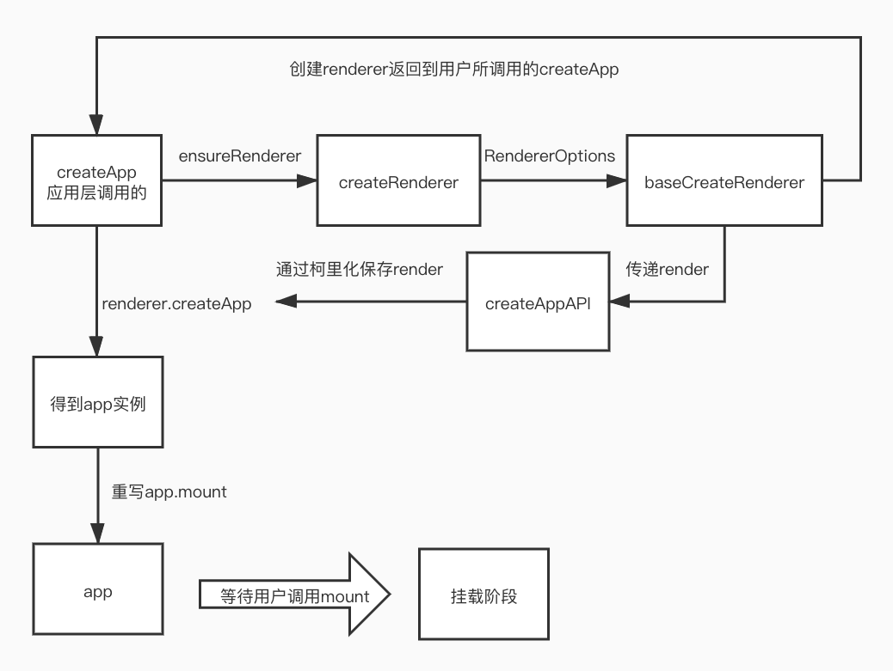

# createApp
## 主要职能是接受app组件创建返回的app实例

## createApp函数内部
1. 创建渲染器（通过`ensureRenderer`延时创建）并调用渲染器的createApp方法创建app实例
2. 重写app的mount方法
3. 返回app实例

### 创建渲染器
```ts
// 得到渲染器，单例
return renderer || (renderer = createRenderer<Node, Element>(rendererOptions))
```
#### `rendererOptions` 
- 这个options中包含了web平台的相关dom操作以及patchProp（custom render API 核心）

#### `createRenderer` -> `baseCreateRenderer` 
  1. 先从options中取出宿主平台的api
  2. 之后定义一个render
  3. 最后返回渲染对象和createApp API

```ts
 // 从options中拿出宿主平台的api
const { ... } = options
// ....
// 声明patch和patch的子过程函数
// 创建渲染函数
const render: RootRenderFunction = (vnode, container) => {
	if (vnode == null) {
		if (container._vnode) {
			unmount(container._vnode, null, null, true)
		}
	} else {
		patch(container._vnode || null, vnode, container)
	}
	flushPostFlushCbs()
	container._vnode = vnode
}
// 返回渲染器对象
return {
	render,
	hydrate,
	createApp: createAppAPI(render, hydrate)
}
```
#### `createAppAPI` 
- 通过柯里化的技巧将render函数以及hydrate参数持有，避免了用户在应用需要传入render函数给createApp
- 方法内部
   - 通过createAppContext创建 app 上下文
   - 创建已安装插件缓存set和isMountedapp 是否挂载标识
   - 通过对象字面量的方式创建了一个完全实现 app 实例接口的对象并且返回出去

### 重写mount方法
- 标准化容器元素 element | string --> element
- 拿到app组件，格式化模板，在挂载前清空容器的innerHTML
- 执行挂载 得到返回的代理对象

```ts
  // 
  const container = normalizeContainer(containerOrSelector);
  // 找不到元素则直接return
  if (!container) return;
  // 拿到app组件
  const component = app._component;
  // 如果既不是函数组件也没有render和模板则取容器元素的innerHTML当做模板
  if (!isFunction(component) && !component.render && !component.template) {
    component.template = container.innerHTML;
  }
  // 在挂载前清空容器的innerHTML
  container.innerHTML = "";
  // 执行挂载 得到返回的代理对象
  const proxy = mount(container);
  return proxy;
};
```


### 为什么Vue3要在createApp的阶段进行渲染器的创建？
> Vue3现在采用了分包的措施，只使用reactivity包的情况，不会创建渲染器，这样也就能通过tree shaking来去除不需要的渲染相关代码。

### 为什么要在createApp中将mount方法重写？
> 将重写mount处理的逻辑和渲染器mount分离，强调了渲染器的单一职责性，让渲染器纯粹的关注渲染相关。

```ts
// core 中的mount，标准的跨平台逻辑
mount(rootContainer) {
  // 创建根组件的 vnode
  const vnode = createVNode(rootComponent, rootProps)
  // 利用渲染器渲染 vnode
  render(vnode, rootContainer)
  app._container = rootContainer
  return vnode.component.proxy
}

// 重写后的逻辑，专属web，我们可以看到初始化了各种web专属的内容，最后调用mount
app.mount = (containerOrSelector) => {
  // 标准化容器
  const container = normalizeContainer(containerOrSelector)
  if (!container)
    return
  const component = app._component
   // 如组件对象没有定义 render 函数和 template 模板，则取容器的 innerHTML 作为组件模板内容
  if (!isFunction(component) && !component.render && !component.template) {
    component.template = container.innerHTML
  }
  // 挂载前清空容器内容
  container.innerHTML = ''
  // 真正的挂载
  return mount(container)
}

```


### custom render API是如何实现的？
> custom render API基本的能力来源于`renderOptions`，以及createApp能对mount方法进行重写。因此custom render API也能分成两个部分：
> - 挂载阶段的准备工作，
> - 挂载渲染阶段需要的对平台进行增删改查的基本 API


### 流程图
