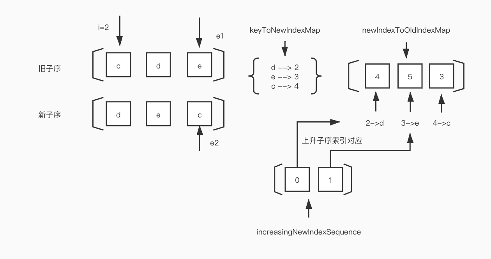

# Diff

1. 同步开始索引
2. 同步尾部索引
3. 同步后旧节点有剩余，unmount
4. 同步后新节点有剩余，patch新的mount
5. 两者都有剩余(未知子序列)

## 未知子序列的处理

### 获取最长顺序子序
- 最初使用了`keyToNewIndexMap`来保存新子序中元素的所对应的索引下标， 
- 然后通过遍历旧子序来查找旧子序child在新子序中的索引， 再使用新子序中的索引`newIndex`作为`newIndexToOldIndexMap`的数组下标来存储child在旧子序中的索引值（有 1 的偏差，后文会解释）， 
- 这样就能得到以新子序的顺序递增并且存储对应child在旧子序中索引的一个`newIndexToOldIndexMap`索引表。
- 这种情况我们只需要从`newIndexToOldIndexMap`中取出一段最长递增子序列就能得到旧子序中出现在新子序的最长的顺序子序， 然后再对更改顺序的元素进行移动即可完成diff。

