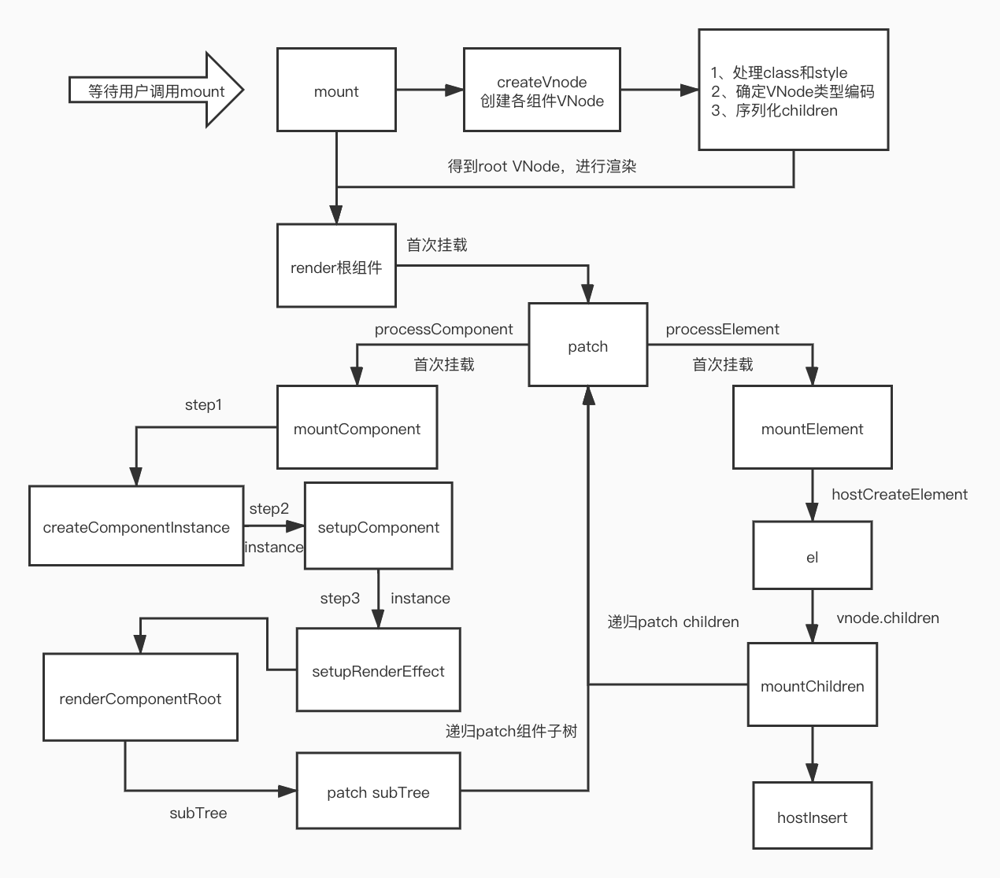
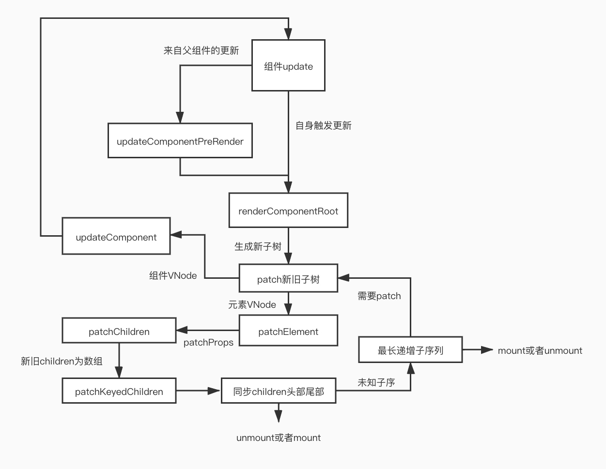

# 组件挂载

## app实例mount挂载应用的过程
- 首先其实这个mount方法被我们在createApp的过程中重写了，他主要干了这些事
1. 根据根信息创建根VNode并绑定上下文
2. 从根VNode开始递归渲染整颗树并挂载到容器上
3. 返回根组件代理


## 怎么创建的VNode，`_createVNode`
- `_createVNode`
1. 如果传入的是一个vnode，`<component :is="vnode"/>` 就clone一份出来
2. 标准化class和style
3. 根据type类型拿到	`shapeFlag`，对象字面量的方式定义vnode
5. 标准化子节点 ---> 确定children类型，标准化children成数组形态、插槽形态或者string、null

## render(vnode, rootContainer) 干了什么
```ts
const render: RootRenderFunction = (vnode, container) => {
  if (vnode == null) {
    // 无新的vnode入参 则代表是卸载
    if (container._vnode) {
      unmount(container._vnode, null, null, true);
    }
  } else {
    // 挂载分支
    patch(container._vnode || null, vnode, container);
  }
  // 执行postFlush任务队列
  flushPostFlushCbs();
  // 保存当前渲染完毕的根VNode在容器上
  container._vnode = vnode;
};

```
## [之后就会进行patch](../resource/jpg/vue3-mount.jpg)


## mount流程图



## update流程图



