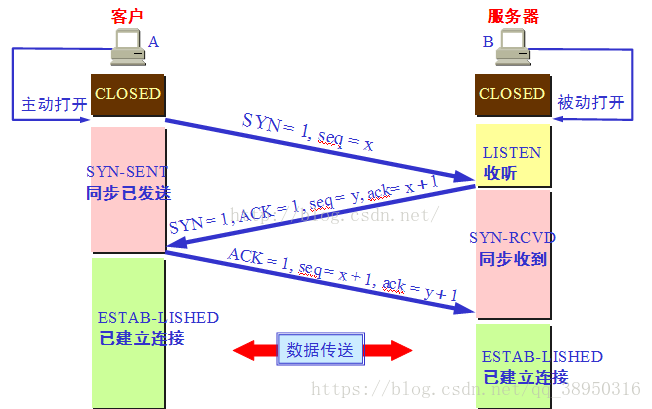

# UDP
## 可靠性
- 无连接
- 不备份，不关心是否收到
- 不拥塞控制，一直会以恒定的速度发送数据
## 高效

# TCP
## 三次握手
1. 客户端向服务端发送连接请求报文段。该报文段中包含自身的数据通讯初始序号。
2. 服务端收到连接请求报文段后，如果同意连接，则会发送一个应答，
3. 当客户端收到连接同意的应答后，还要向服务端发送一个确认报文。
- A 发送消息（你好我是A）
- B 接受到后回一个消息（收到，我是B）
- A 发送消息（那我们建立链接把）

- 

### 为什么 客户端 最后还要发送一次确认？
- 为了避免失效报文再次到达服务器，让服务器误以为又一次tcp开始从而长时间保持打开状态   

## 四次放手
1. 客户端发生释放链接报文，并停止发数据主动关闭tcp链接，进入 FIN-WAIT-1 (终止等待1) 状态
2. 服务器收到连接释放报文段后即发出确认，就进入 CLOSEWAIT（关闭等待）状态，此时如果服务端还有数据没发完还是继续；客户端收到消息，进入 FIN-WAIT-2(终止等待2) 状态，等待 服务器 发出的连接释放报文段。
3. 服务器没有数据要发了，重复上次已发送过的确认号 ack = u + 1。并且FIN = 1， LAST-ACK (最后确认) 状态
4. 客户端发确认，然后进入到 TIME-WAIT(时间等待) 状态。请注意，TCP 连接现在还没有释放掉。必须经过 时间等待计时器（TIME-WAIT）设置的时间 2MSL 后，客户端 才进入到 CLOSED 状态。时间 MSL 叫做 最长报文段寿命，RFC 793 建议设为 2 分钟。

- A：“任务处理完毕，我希望断开连接。”
- B：“哦，是吗？请稍等，我准备一下。”
等待片刻后……
- B：“我准备好了，可以断开连接了。”
- A：“好的，谢谢合作。”

- 

### 为什么 客户端 在 TIME-WAIT 状态必须等待 2MSL 的时间呢？
- 为了避免最后一个报丢失导致服务器不释放
- 时间长了，服务器会在发一次，客户端收到后重新2MSL时间
- 同时可以让那个网络中不在存在要释放的这个tcp的所有报文（最长报文段寿命）
  
### 如果已经建立了连接，但是客户端突然出现故障了怎么办？
- TCP 设有一个 保活计时器。服务器每收到一次客户的数据，就重新设置保活计时器，时间的设置通常是两小时。
- 若两小时没有收到客户的数据，服务器就发送一个 探测报文段 ，以后则每隔 75 秒钟发送一次。
- 若一连发送 10 个探测报文段后仍无客户的响应，服务器就认为客户端出了故障，接着就关闭这个连接。

### 问题：A、B 机器正常连接后，B 机器突然重启，问 A 此时 处于 TCP 什么状态
- 因为 B 会在重启之后进入 tcp 状态机的 listen 状态，只要当 a 重新发送一个数据包，b 端应该会主动发送一个重置 包来进行连接重置，所以 a 应该在 syn_sent 状态

### 一个tcp能发几个http请求
- 1.0 1个
- 1.1 多个
- 2.0 多用复用，可以并发多个

## 滑动窗口 -- 表征发送端和接收端的接收能力
1. 已收到ack确认的数据。
2. 发还没收到ack的。
3. 在窗口中还没有发出的（接收方还有空间）。
4. 窗口以外的数据（接收方没空间）

## 拥塞窗口 -- 表征中间设备的传输能力
1. 慢启动
   - 刚刚加入网络的连接，一点一点地提速
   - 先初始化cwnd = 1(不一定，也可能时10),表明可以传1个MSS大小数据
   - 每当收到一个ACK，cwnd++；线性上升
   - 每经过一个RTT(往返时延)，cwnd = cwnd*2; 呈指数让升
   - 当值达到ssthresh（慢启动阈值，一般 65535）时进入拥塞避免算法
2. 拥塞避免
   - 收到一个ACK时，cwnd = cwnd + 1/cwnd
   - 当每过一个RTT时，cwnd = cwnd + 1
3. 拥塞发生
   - 分为两种情况
   - 等到RTO超时，重传数据包
     - sshthresh =  cwnd /2；cwnd 重置为 1；进入慢启动
   - Fast Retransmit算法，也就是在收到3个duplicate ACK时就开启重传，而不用等到RTO超时
     - cwnd = cwnd /2；sshthresh = cwnd；进入快速恢复算法
4. 快速恢复
   - cwnd = sshthresh  + 3 * MSS （3的意思是确认有3个数据包被收到了）
   - 重传Duplicated ACKs指定的数据包
   - 如果再收到 duplicated Acks，那么cwnd = cwnd +1
   - 如果收到了新的Ack，那么，cwnd = sshthresh ，然后就进入了拥塞避免的算法了。
